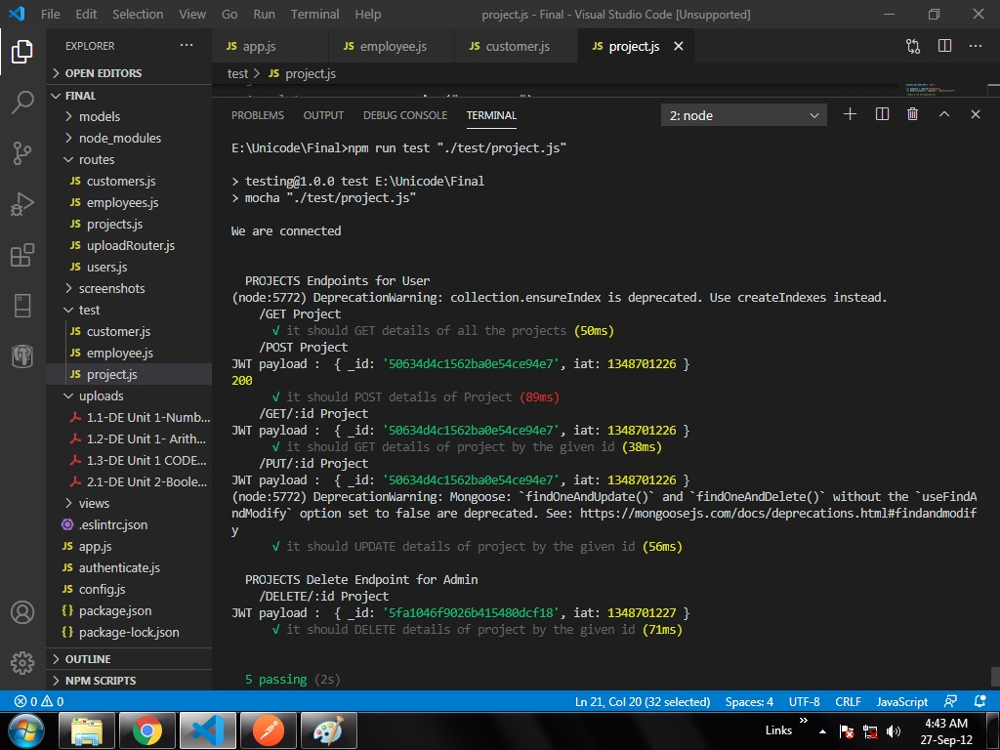

# Project Management System
Tasks for Unicode learning period

## Project Structure

```
.
├── config/                 -> Contains secret key for queries
├── models/                 -> Contains database models
├── routes/                 -> Files exporting respective routers for endpoints
├── app.js                  -> Main File
└── package.json            -> Npm package.json file
```
## Usage
```
node app.js
```
## Endpoints
All root endpoints have their separate router in `./router` folder

|Endpoints              |Description                                                                    |Methods               |
|-----------------------|-------------------------------------------------------------------------------|----------------------|
|/                      |Home Page(Just have added a random view of form)                                                                    |GET                   |
|/users                 | Displays List Of Users                                                        |GET                   |
|/users/signup          |Sign Up page for a user                                                        |POST                 |
|/users/login           |Login of a user                                                                |POST                  |
|/users/logout          |User logout                                                                    |POST                  |
|/users/delete/:username|Delete a user from database                                                    |DELETE               |
|/employees             |List of all emplloyees and add new employee                                    |GET , POST           |
|/employees/:id         |Details of specified employee                                                  |GET, PUT, DELETE     |
|/projects              |List of all projects                                                           |GET, POST             |
|/projects/:id          |Details of specified project                                                   |GET, PUT, DELETE      |
|/customers             |List of all customers                                                          |GET, POST, DELETE     |
|/customers/:id         |Details of specified customer                                                  |GET, PUT, DELETE      |

The get request for the user is to check if the user is authenticated or not. All the routesthen i.e to the employees, projects and customers require authentication for  POST to add ,PUT , DELETE and GET a specific employee,project,customer                   

# Testing
## User Sign Up


## User Login


## User Logout
(Redirects to home page which is a Student Form)


## Only after logging in and including the token as Bearer token in Authorization headers , the user will be able to GET,POST,PUT or DELETE .

# Employee

## Get all Employee details


## Add an Employee detail


## Get an Employee detail by id


## Update an Employee detail by id


## Delete an Employee detail by id


# Project

## Get all Project details


## Add an Project detail


## Get an Project detail by id


## Update an Project detail by id


## Delete an Project detail by id


# Customer

## Get all Customer details


## Add an Customer detail


## Get an Customer detail by id


## Update an Customer detail by id


## Delete an Customer detail by id


# Testing

## Testing Employee endpoint


## Testing Project endpoint



## Testing Customer endpoint


